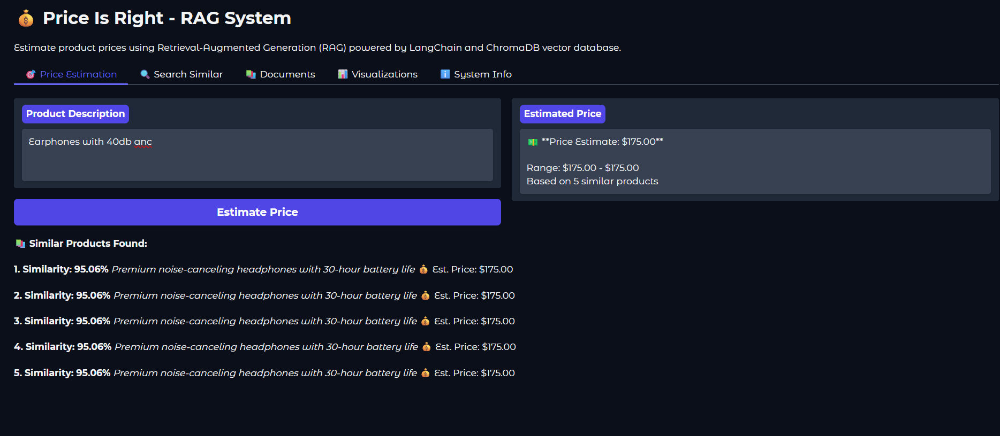

# Price Is Right – Autonomous AI Agent System

## Project Overview

Price Is Right is an autonomous AI system that monitors online deals and determines whether a product is undervalued by leveraging AI-driven price estimation and intelligent agent coordination.

The system combines:

- Retrieval-Augmented Generation (RAG)
- Vector similarity search
- LLM-based price estimation
- Multi-agent orchestration
- Real-time deal discovery
- Automated notifications

The system processes product information, retrieves comparable market data from a vector store, estimates fair market prices using language models, and identifies exceptional deals where current prices fall below estimated fair value.

---

# Demo

Below are screenshots of the system interface and functionality.



## Document Ingestion

Users can upload documents which are automatically processed by the ingestion pipeline.  
The system performs text chunking, embedding generation, and stores vectors in ChromaDB.

---

## Semantic Search

The system allows semantic similarity search over ingested documents.

Users can enter a query and retrieve the most relevant documents based on vector similarity.

---

## RAG Query Interface

Users can query the system using natural language.

The RAG pipeline retrieves relevant context and augments the LLM prompt to generate grounded answers.

---

## Embedding Space Visualization

To help interpret the vector space, the system provides interactive embedding visualization.

High dimensional embeddings are projected using **t-SNE dimensionality reduction**.

This allows exploration of semantic clusters.

---

## t-SNE Cluster Visualization

The system visualizes semantic clusters of documents in embedding space.

Documents with similar meaning cluster together in the visualization.

---

## AI Price Estimation

The system estimates the fair market price of products using a fine-tuned LLM.

Users can input a product description and the system returns:

- Estimated price
- Similar products retrieved via vector search
- Context supporting the prediction

---

# Architecture Overview

The system follows a modular pipeline architecture.

Deal Sources
↓
Document Ingestion & Chunking
↓
Embedding Generation
↓
Vector Store (ChromaDB)
↓
RAG Retrieval Pipeline
↓
LLM Price Estimation
↓
Agent Orchestration & Analysis
↓
Opportunity Detection
↓
Gradio Web Interface

---

# Repository Structure

## Core Directory

`core/` contains the entire application logic.

Entry points:

core/main.py
core/gradio_app.py

The directory is organized into modular components.

---

## Agents

`core/agents/`

Implements the agent framework used for orchestrating workflows.

Files include:

- `base_agent.py`
- `rag_agent.py`
- `planning_agent.py`
- `specialist_agent.py`
- `messenger_agent.py`
- `scanner_agent.py`
- `deals.py`

Agents coordinate retrieval, reasoning, deal evaluation, and notifications.

---

## RAG Pipelines

`core/rag/`

Multiple RAG implementations demonstrating different frameworks.

langchain_rag.py
haystack_rag.py
llamaindex_rag.py

LangChain is the primary implementation.

---

## Vector Database

`core/vectorstore/`

ChromaDB vector store wrapper.

Handles:

- document storage
- embeddings
- semantic retrieval

---

## Embeddings

`core/embeddings/`

Embedding generation using Sentence Transformers.

Default model:

sentence-transformers/all-MiniLM-L6-v2

---

## Document Ingestion

`core/ingestion/`

Handles document loading and chunking.

Includes:

document_loader.py

---

## Services

`core/services/`

Business logic and integrations.

Examples:

pricer_service.py
retrieval_service.py
pricer_ephemeral.py

Price estimation models are served via Modal.

---

## Observability

`core/observability/`

Monitoring and tracing infrastructure.

Includes:

langfuse_config.py
metrics_prometheus.py
tracing_jaeger.py

Supports:

- LLM tracing
- distributed tracing
- performance metrics

---

## Visualization

`core/visualization/`

t-SNE visualization of embeddings.

Includes:

tsne_visualizer.py

Supports:

- 2D embedding visualization
- 3D embedding visualization
- cluster exploration

---

## User Interface

`core/ui/`

Gradio interface.

gradio_app.py

Provides interactive querying and visualization.

---

# RAG Pipeline

The Retrieval-Augmented Generation system performs:

### Document Ingestion

Documents are:

- loaded
- split into chunks
- embedded
- stored in vector database

### Embeddings

Embeddings are generated using Sentence Transformers.

### Vector Retrieval

Queries are embedded and compared against stored embeddings.

Top-k relevant documents are retrieved.

### Context Augmentation

Retrieved context is appended to LLM prompts.

### Generation

The LLM generates grounded answers using retrieved context.

---

# Agent Framework

The system uses an agent architecture for orchestrating tasks.

Agents include:

### RAG Agent

Handles document retrieval and answer generation.

### Planning Agent

Analyzes deal opportunities and coordinates agents.

### Scanner Agent

Monitors RSS feeds for deals.

### Messaging Agent

Sends notifications using Pushover.

### Ensemble Agent

Combines multiple pricing models.

---

# Vector Database

The system uses **ChromaDB**.

Features include:

- persistent storage
- semantic retrieval
- fast similarity search
- metadata indexing

---

# Visualization

Embedding space is visualized using **t-SNE**.

Interactive plots are created with **Plotly**.

This helps analyze semantic relationships between documents.

---

# User Interface

The system provides an interactive UI using **Gradio**.

Features include:

- document upload
- semantic search
- RAG queries
- embedding visualization
- price estimation

---

# Docker Execution

The system runs inside a container using a single Dockerfile.

Container execution:

```bash
python -m core.main
```

Docker handles:

- dependency installation
- environment setup
- application launch

---

# Technology Stack

Programming Language

- Python 3.12

RAG Frameworks

- LangChain
- Haystack
- LlamaIndex

Vector Database

- ChromaDB

Embeddings

- Sentence Transformers

ML Libraries

- Transformers
- Torch
- Scikit-learn
- SciPy

Visualization

- Plotly

User Interface

- Gradio

Observability

- LangFuse
- Prometheus
- Jaeger
- OpenTelemetry

Infrastructure

- Docker
- Modal

Package Management

- uv
- pip

---

# Dependencies

Dependencies are managed using **uv**.

Install environment:

```bash
uv sync
```

Run application:

```bash
uv run python core/main.py
```

---

# Running the Project

## Local Development

Install dependencies

```bash
uv sync
```

Run application

```bash
uv run python core/main.py
```

Open the interface at:

http://localhost:7860

---

## Docker Deployment

Build container

```bash
docker build -t price-is-right
```

Run container

```bash
docker run -p 7860:7860 price-is-right
```

Access interface:

http://localhost:7860

---

# Environment Configuration

Create `.env` file.

OPENAI_API_KEY=your-key
LANGFUSE_PUBLIC_KEY=your-key
LANGFUSE_SECRET_KEY=your-key
CHROMA_DB_PATH=./chroma_db

---

# Future Work

Possible improvements include:

- additional deal sources
- improved price estimation models
- better agent collaboration
- full observability dashboards
- model fine-tuning
- distributed processing
- feedback loops for price prediction improvement

---

# License

MIT License
